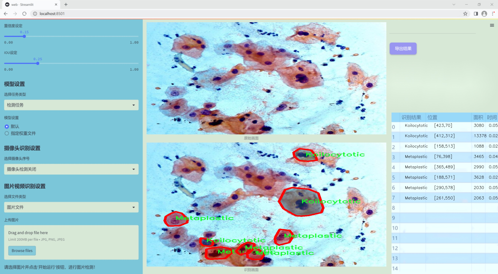
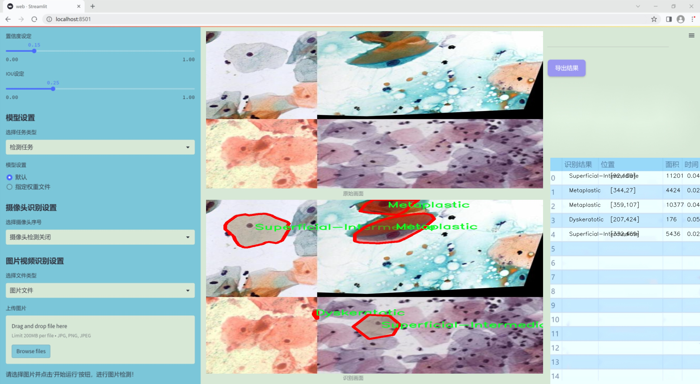
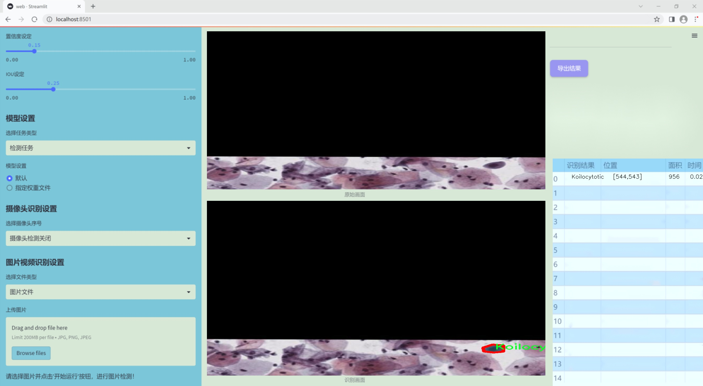
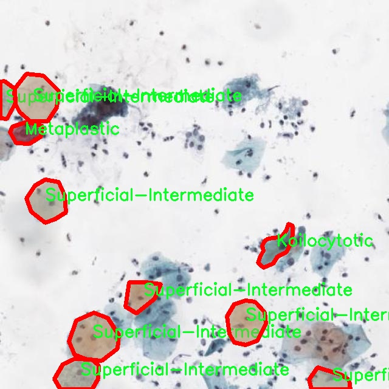
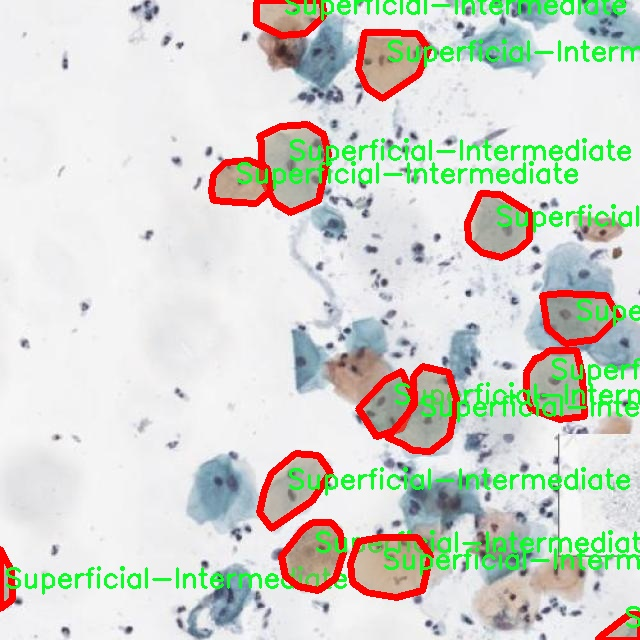
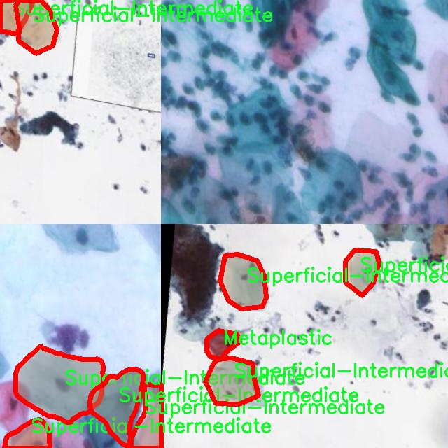
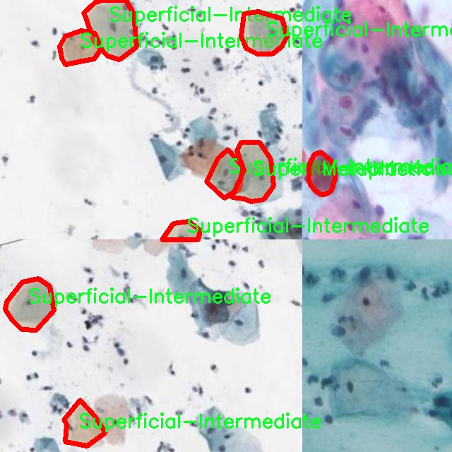
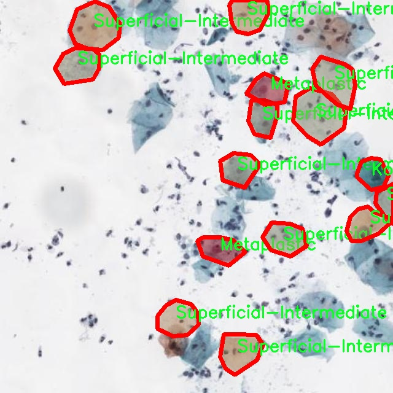

### 1.背景意义

研究背景与意义

细胞类型的识别在医学诊断、疾病监测和生物研究中具有重要意义。随着计算机视觉技术的快速发展，基于深度学习的图像识别方法逐渐成为细胞分类的主流手段。YOLO（You Only Look Once）系列模型因其高效的实时检测能力和较高的准确性，广泛应用于各种视觉任务。尤其是YOLOv11作为该系列的最新版本，凭借其改进的网络结构和算法，能够更好地处理复杂的图像特征，提升细胞类型识别的精度和速度。

在细胞病理学中，准确识别不同类型的细胞对于早期诊断和治疗方案的制定至关重要。通过对细胞进行分类，可以帮助医生更好地理解病变的性质，从而制定个性化的治疗方案。本研究将基于改进的YOLOv11模型，开发一个细胞类型识别系统，旨在提高对五种特定细胞类型（如Dyskeratotic、Koilocytotic、Metaplastic、Parabasal和Superficial-Intermediate）的识别能力。

本项目所使用的数据集包含1700幅经过精细标注的细胞图像，涵盖了多种细胞类型。数据集的多样性和丰富性为模型的训练提供了良好的基础。通过对数据集的有效利用，结合YOLOv11的强大功能，我们期望能够显著提升细胞识别的准确率，并在此基础上为相关领域的研究提供新的思路和方法。

此外，随着医学影像数据的不断增加，如何高效、准确地处理和分析这些数据成为一个亟待解决的问题。本研究不仅具有重要的理论价值，也为实际应用提供了有力的支持。通过构建一个高效的细胞类型识别系统，我们希望能够推动细胞生物学和医学影像分析领域的发展，为未来的研究和临床应用奠定基础。

### 2.视频效果

[2.1 视频效果](https://www.bilibili.com/video/BV1CMkEYBE7r/)

### 3.图片效果







##### [项目涉及的源码数据来源链接](https://kdocs.cn/l/cszuIiCKVNis)**

注意：本项目提供训练的数据集和训练教程,由于版本持续更新,暂不提供权重文件（best.pt）,请按照6.训练教程进行训练后实现上图演示的效果。

### 4.数据集信息

##### 4.1 本项目数据集类别数＆类别名

nc: 5
names: ['Dyskeratotic', 'Koilocytotic', 'Metaplastic', 'Parabasal', 'Superficial-Intermediate']


该项目为【图像分割】数据集，请在【训练教程和Web端加载模型教程（第三步）】这一步的时候按照【图像分割】部分的教程来训练

##### 4.2 本项目数据集信息介绍

本项目数据集信息介绍

本项目所使用的数据集旨在为改进YOLOv11的细胞类型识别系统提供坚实的基础。该数据集围绕“many_toget”主题构建，专注于细胞类型的分类与识别，涵盖了五种不同的细胞类别。这些类别分别为：Dyskeratotic（角化不良细胞）、Koilocytotic（空泡细胞）、Metaplastic（化生细胞）、Parabasal（基底细胞）和Superficial-Intermediate（表层-中间细胞）。每一种细胞类型在临床病理学中具有重要的诊断意义，因此准确的识别和分类对于疾病的早期发现和治疗至关重要。

数据集的构建过程遵循严格的标准，确保每一类细胞样本的代表性和多样性。样本来源于多种临床样本和实验室切片，经过精细的标注和分类，确保每个细胞图像都能准确反映其对应的类别特征。这种多样化的样本收集策略不仅提高了模型的泛化能力，也增强了其在不同条件下的识别准确性。

在数据集的标注过程中，采用了先进的图像处理技术，以确保细胞特征的清晰可辨。每个细胞图像都经过专业的病理学家审核，确保标注的准确性和一致性。这种高质量的数据集为YOLOv11模型的训练提供了丰富的学习材料，使其能够更好地理解和识别不同类型的细胞。

通过对这些细胞类型的深入学习，改进后的YOLOv11系统将能够在临床应用中实现更高效的细胞识别和分类，为病理诊断提供有力支持。最终目标是提升细胞识别的准确性和效率，推动医学影像分析领域的发展。











### 5.全套项目环境部署视频教程（零基础手把手教学）

[5.1 所需软件PyCharm和Anaconda安装教程（第一步）](https://www.bilibili.com/video/BV1BoC1YCEKi/?spm_id_from=333.999.0.0&vd_source=bc9aec86d164b67a7004b996143742dc)


[5.2 安装Python虚拟环境创建和依赖库安装视频教程（第二步）](https://www.bilibili.com/video/BV1ZoC1YCEBw?spm_id_from=333.788.videopod.sections&vd_source=bc9aec86d164b67a7004b996143742dc)

### 6.改进YOLOv11训练教程和Web_UI前端加载模型教程（零基础手把手教学）

[6.1 改进YOLOv11训练教程和Web_UI前端加载模型教程（第三步）](https://www.bilibili.com/video/BV1BoC1YCEhR?spm_id_from=333.788.videopod.sections&vd_source=bc9aec86d164b67a7004b996143742dc)


按照上面的训练视频教程链接加载项目提供的数据集，运行train.py即可开始训练



     Epoch   gpu_mem       box       obj       cls    labels  img_size
     1/200     20.8G   0.01576   0.01955  0.007536        22      1280: 100%|██████████| 849/849 [14:42<00:00,  1.04s/it]
               Class     Images     Labels          P          R     mAP@.5 mAP@.5:.95: 100%|██████████| 213/213 [01:14<00:00,  2.87it/s]
                 all       3395      17314      0.994      0.957      0.0957      0.0843

     Epoch   gpu_mem       box       obj       cls    labels  img_size
     2/200     20.8G   0.01578   0.01923  0.007006        22      1280: 100%|██████████| 849/849 [14:44<00:00,  1.04s/it]
               Class     Images     Labels          P          R     mAP@.5 mAP@.5:.95: 100%|██████████| 213/213 [01:12<00:00,  2.95it/s]
                 all       3395      17314      0.996      0.956      0.0957      0.0845

     Epoch   gpu_mem       box       obj       cls    labels  img_size
     3/200     20.8G   0.01561    0.0191  0.006895        27      1280: 100%|██████████| 849/849 [10:56<00:00,  1.29it/s]
               Class     Images     Labels          P          R     mAP@.5 mAP@.5:.95: 100%|███████   | 187/213 [00:52<00:00,  4.04it/s]
                 all       3395      17314      0.996      0.957      0.0957      0.0845


###### [项目数据集下载链接](https://kdocs.cn/l/cszuIiCKVNis)

### 7.原始YOLOv11算法讲解


YOLO11 是 Ultralytics YOLO 系列的最新版本，结合了尖端的准确性、速度和效率，用于目标检测、分割、分类、定向边界框和姿态估计。与
YOLOv8 相比，它具有更少的参数和更好的结果，不难预见，YOLO11 在边缘设备上更高效、更快，将频繁出现在计算机视觉领域的最先进技术（SOTA）中。


**主要特点**

  * **增强的特征提取：**YOLO11 使用改进的主干和颈部架构来增强特征提取，以实现更精确的目标检测和复杂任务的性能。

  * **针对效率和速度优化：**精细的架构设计和优化的训练流程在保持准确性和性能之间最佳平衡的同时，提供更快的处理速度。

  * **更少的参数，更高的准确度：**YOLO11m 在 COCO 数据集上实现了比 YOLOv8m 更高的 mAP，参数减少了 22%，提高了计算效率，同时不牺牲准确度。

  * **跨环境的适应性：**YOLO11 可以无缝部署在边缘设备、云平台和配备 NVIDIA GPU 的系统上，确保最大的灵活性。

  * **支持广泛的任务范围：**YOLO11 支持各种计算机视觉任务，如目标检测、实例分割、图像分类、姿态估计和定向目标检测（OBB）。


### 8.200+种全套改进YOLOV11创新点原理讲解

#### 8.1 200+种全套改进YOLOV11创新点原理讲解大全

由于篇幅限制，每个创新点的具体原理讲解就不全部展开，具体见下列网址中的改进模块对应项目的技术原理博客网址【Blog】（创新点均为模块化搭建，原理适配YOLOv5~YOLOv11等各种版本）

[改进模块技术原理博客【Blog】网址链接](https://gitee.com/qunmasj/good)


#### 8.2 精选部分改进YOLOV11创新点原理讲解

###### 这里节选部分改进创新点展开原理讲解(完整的改进原理见上图和[改进模块技术原理博客链接](https://gitee.com/qunmasj/good)【如果此小节的图加载失败可以通过CSDN或者Github搜索该博客的标题访问原始博客，原始博客图片显示正常】
### RepViT简介

近年来，与轻量级卷积神经网络(cnn)相比，轻量级视觉变压器(ViTs)在资源受限的移动设备上表现出了更高的性能和更低的延迟。这种改进通常归功于多头自注意模块，它使模型能够学习全局表示。然而，轻量级vit和轻量级cnn之间的架构差异还没有得到充分的研究。在这项研究中，我们重新审视了轻量级cnn的高效设计，并强调了它们在移动设备上的潜力。通过集成轻量级vit的高效架构选择，我们逐步增强了标准轻量级CNN的移动友好性，特别是MobileNetV3。这就产生了一个新的纯轻量级cnn家族，即RepViT。大量的实验表明，RepViT优于现有的轻型vit，并在各种视觉任务中表现出良好的延迟。在ImageNet上，RepViT在iPhone 12上以近1ms的延迟实现了超过80%的top-1精度，据我们所知，这是轻量级模型的第一次。

#### RepViT简介
轻量级模型研究一直是计算机视觉任务中的一个焦点，其目标是在降低计算成本的同时达到优秀的性能。轻量级模型与资源受限的移动设备尤其相关，使得视觉模型的边缘部署成为可能。在过去十年中，研究人员主要关注轻量级卷积神经网络（CNNs）的设计，提出了许多高效的设计原则，包括可分离卷积 、逆瓶颈结构 、通道打乱 和结构重参数化等，产生了 MobileNets ，ShuffleNets和 RepVGG 等代表性模型。

另一方面，视觉 Transformers（ViTs）成为学习视觉表征的另一种高效方案。与 CNNs 相比，ViTs 在各种计算机视觉任务中表现出了更优越的性能。然而，ViT 模型一般尺寸很大，延迟很高，不适合资源受限的移动设备。因此，研究人员开始探索 ViT 的轻量级设计。许多高效的ViTs设计原则被提出，大大提高了移动设备上 ViTs 的计算效率，产生了EfficientFormers ，MobileViTs等代表性模型。这些轻量级 ViTs 在移动设备上展现出了相比 CNNs 的更强的性能和更低的延迟。

轻量级 ViTs 优于轻量级 CNNs 的原因通常归结于多头注意力模块，该模块使模型能够学习全局表征。然而，轻量级 ViTs 和轻量级 CNNs 在块结构、宏观和微观架构设计方面存在值得注意的差异，但这些差异尚未得到充分研究。这自然引出了一个问题：轻量级 ViTs 的架构选择能否提高轻量级 CNN 的性能？在这项工作中，我们结合轻量级 ViTs 的架构选择，重新审视了轻量级 CNNs 的设计。我们的旨在缩小轻量级 CNNs 与轻量级 ViTs 之间的差距，并强调前者与后者相比在移动设备上的应用潜力。


在 ConvNeXt 中，参考该博客提出的基于 ResNet50 架构的基础上通过严谨的理论和实验分析，最终设计出一个非常优异的足以媲美 Swin-Transformer 的纯卷积神经网络架构。同样地，RepViT也是主要通过将轻量级 ViTs 的架构设计逐步整合到标准轻量级 CNN，即MobileNetV3-L，来对其进行针对性地改造（魔改）。在这个过程中，作者们考虑了不同粒度级别的设计元素，并通过一系列步骤达到优化的目标。


详细优化步骤如下：

#### 训练配方的对齐
论文中引入了一种衡量移动设备上延迟的指标，并将训练策略与现有的轻量级 ViTs 对齐。这一步骤主要是为了确保模型训练的一致性，其涉及两个概念，即延迟度量和训练策略的调整。

#### 延迟度量指标
为了更准确地衡量模型在真实移动设备上的性能，作者选择了直接测量模型在设备上的实际延迟，以此作为基准度量。这个度量方法不同于之前的研究，它们主要通过FLOPs或模型大小等指标优化模型的推理速度，这些指标并不总能很好地反映在移动应用中的实际延迟。

#### 训练策略的对齐
这里，将 MobileNetV3-L 的训练策略调整以与其他轻量级 ViTs 模型对齐。这包括使用 AdamW 优化器-ViTs 模型必备的优化器，进行 5 个 epoch 的预热训练，以及使用余弦退火学习率调度进行 300 个 epoch 的训练。尽管这种调整导致了模型准确率的略微下降，但可以保证公平性。

#### 块设计的优化
基于一致的训练设置，作者们探索了最优的块设计。块设计是 CNN 架构中的一个重要组成部分，优化块设计有助于提高网络的性能。

#### 分离 Token 混合器和通道混合器
这块主要是对 MobileNetV3-L 的块结构进行了改进，分离了令牌混合器和通道混合器。原来的 MobileNetV3 块结构包含一个 1x1 扩张卷积，然后是一个深度卷积和一个 1x1 的投影层，然后通过残差连接连接输入和输出。在此基础上，RepViT 将深度卷积提前，使得通道混合器和令牌混合器能够被分开。为了提高性能，还引入了结构重参数化来在训练时为深度滤波器引入多分支拓扑。最终，作者们成功地在 MobileNetV3 块中分离了令牌混合器和通道混合器，并将这种块命名为 RepViT 块。

#### 降低扩张比例并增加宽度
在通道混合器中，原本的扩张比例是 4，这意味着 MLP 块的隐藏维度是输入维度的四倍，消耗了大量的计算资源，对推理时间有很大的影响。为了缓解这个问题，我们可以将扩张比例降低到 2，从而减少了参数冗余和延迟，使得 MobileNetV3-L 的延迟降低到 0.65ms。随后，通过增加网络的宽度，即增加各阶段的通道数量，Top-1 准确率提高到 73.5%，而延迟只增加到 0.89ms！

#### 宏观架构元素的优化
在这一步，本文进一步优化了MobileNetV3-L在移动设备上的性能，主要是从宏观架构元素出发，包括 stem，降采样层，分类器以及整体阶段比例。通过优化这些宏观架构元素，模型的性能可以得到显著提高。

#### 浅层网络使用卷积提取器
ViTs 通常使用一个将输入图像分割成非重叠补丁的 “patchify” 操作作为 stem。然而，这种方法在训练优化性和对训练配方的敏感性上存在问题。因此，作者们采用了早期卷积来代替，这种方法已经被许多轻量级 ViTs 所采纳。对比之下，MobileNetV3-L 使用了一个更复杂的 stem 进行 4x 下采样。这样一来，虽然滤波器的初始数量增加到24，但总的延迟降低到0.86ms，同时 top-1 准确率提高到 73.9%。

#### 更深的下采样层
在 ViTs 中，空间下采样通常通过一个单独的补丁合并层来实现。因此这里我们可以采用一个单独和更深的下采样层，以增加网络深度并减少由于分辨率降低带来的信息损失。具体地，作者们首先使用一个 1x1 卷积来调整通道维度，然后将两个 1x1 卷积的输入和输出通过残差连接，形成一个前馈网络。此外，他们还在前面增加了一个 RepViT 块以进一步加深下采样层，这一步提高了 top-1 准确率到 75.4%，同时延迟为 0.96ms。

#### 更简单的分类器
在轻量级 ViTs 中，分类器通常由一个全局平均池化层后跟一个线性层组成。相比之下，MobileNetV3-L 使用了一个更复杂的分类器。因为现在最后的阶段有更多的通道，所以作者们将它替换为一个简单的分类器，即一个全局平均池化层和一个线性层，这一步将延迟降低到 0.77ms，同时 top-1 准确率为 74.8%。

#### 整体阶段比例
阶段比例代表了不同阶段中块数量的比例，从而表示了计算在各阶段中的分布。论文选择了一个更优的阶段比例 1:1:7:1，然后增加网络深度到 2:2:14:2，从而实现了一个更深的布局。这一步将 top-1 准确率提高到 76.9%，同时延迟为 1.02 ms。

#### 卷积核大小的选择
众所周知，CNNs 的性能和延迟通常受到卷积核大小的影响。例如，为了建模像 MHSA 这样的远距离上下文依赖，ConvNeXt 使用了大卷积核，从而实现了显著的性能提升。然而，大卷积核对于移动设备并不友好，因为它的计算复杂性和内存访问成本。MobileNetV3-L 主要使用 3x3 的卷积，有一部分块中使用 5x5 的卷积。作者们将它们替换为3x3的卷积，这导致延迟降低到 1.00ms，同时保持了76.9%的top-1准确率。

#### SE 层的位置
自注意力模块相对于卷积的一个优点是根据输入调整权重的能力，这被称为数据驱动属性。作为一个通道注意力模块，SE层可以弥补卷积在缺乏数据驱动属性上的限制，从而带来更好的性能。MobileNetV3-L 在某些块中加入了SE层，主要集中在后两个阶段。然而，与分辨率较高的阶段相比，分辨率较低的阶段从SE提供的全局平均池化操作中获得的准确率提升较小。作者们设计了一种策略，在所有阶段以交叉块的方式使用SE层，从而在最小的延迟增量下最大化准确率的提升，这一步将top-1准确率提升到77.4%，同时延迟降低到0.87ms。

注意！【这一点其实百度在很早前就已经做过实验比对得到过这个结论了，SE 层放置在靠近深层的地方效果好】

#### 微观设计的调整
RepViT 通过逐层微观设计来调整轻量级 CNN，这包括选择合适的卷积核大小和优化挤压-激励（Squeeze-and-excitation，简称SE）层的位置。这两种方法都能显著改善模型性能。

#### 网络架构
最终，通过整合上述改进策略，我们便得到了模型RepViT的整体架构，该模型有多个变种，例如RepViT-M1/M2/M3。同样地，不同的变种主要通过每个阶段的通道数和块数来区分。


### 9.系统功能展示

图9.1.系统支持检测结果表格显示

  图9.2.系统支持置信度和IOU阈值手动调节

  图9.3.系统支持自定义加载权重文件best.pt(需要你通过步骤5中训练获得)

  图9.4.系统支持摄像头实时识别

  图9.5.系统支持图片识别

  图9.6.系统支持视频识别

  图9.7.系统支持识别结果文件自动保存

  图9.8.系统支持Excel导出检测结果数据


### 10. YOLOv11核心改进源码讲解

#### 10.1 attention.py

以下是经过精简和注释的核心代码，主要保留了几个重要的注意力机制模块及其相关功能。每个类和方法都添加了详细的中文注释，以帮助理解其功能和实现。

```python
import torch
from torch import nn
import torch.nn.functional as F

class EMA(nn.Module):
    """ Exponential Moving Average 模块 """
    def __init__(self, channels, factor=8):
        super(EMA, self).__init__()
        self.groups = factor  # 分组数
        assert channels // self.groups > 0  # 确保每组至少有一个通道
        self.softmax = nn.Softmax(-1)  # Softmax 激活函数
        self.agp = nn.AdaptiveAvgPool2d((1, 1))  # 自适应平均池化
        self.pool_h = nn.AdaptiveAvgPool2d((None, 1))  # 自适应池化，输出宽度为1
        self.pool_w = nn.AdaptiveAvgPool2d((1, None))  # 自适应池化，输出高度为1
        self.gn = nn.GroupNorm(channels // self.groups, channels // self.groups)  # 分组归一化
        self.conv1x1 = nn.Conv2d(channels // self.groups, channels // self.groups, kernel_size=1)  # 1x1卷积
        self.conv3x3 = nn.Conv2d(channels // self.groups, channels // self.groups, kernel_size=3, padding=1)  # 3x3卷积

    def forward(self, x):
        b, c, h, w = x.size()  # 获取输入的批量大小、通道数、高度和宽度
        group_x = x.reshape(b * self.groups, -1, h, w)  # 重新调整形状以适应分组
        x_h = self.pool_h(group_x)  # 对每组进行高度池化
        x_w = self.pool_w(group_x).permute(0, 1, 3, 2)  # 对每组进行宽度池化并转置
        hw = self.conv1x1(torch.cat([x_h, x_w], dim=2))  # 连接高度和宽度池化结果并通过1x1卷积
        x_h, x_w = torch.split(hw, [h, w], dim=2)  # 分割回高度和宽度
        x1 = self.gn(group_x * x_h.sigmoid() * x_w.permute(0, 1, 3, 2).sigmoid())  # 计算加权的分组归一化
        x2 = self.conv3x3(group_x)  # 通过3x3卷积处理原始输入
        x11 = self.softmax(self.agp(x1).reshape(b * self.groups, -1, 1).permute(0, 2, 1))  # 计算x1的softmax
        x12 = x2.reshape(b * self.groups, c // self.groups, -1)  # 重新调整x2的形状
        x21 = self.softmax(self.agp(x2).reshape(b * self.groups, -1, 1).permute(0, 2, 1))  # 计算x2的softmax
        x22 = x1.reshape(b * self.groups, c // self.groups, -1)  # 重新调整x1的形状
        weights = (torch.matmul(x11, x12) + torch.matmul(x21, x22)).reshape(b * self.groups, 1, h, w)  # 计算权重
        return (group_x * weights.sigmoid()).reshape(b, c, h, w)  # 返回加权后的结果

class SimAM(nn.Module):
    """ SimAM 模块 """
    def __init__(self, e_lambda=1e-4):
        super(SimAM, self).__init__()
        self.activaton = nn.Sigmoid()  # Sigmoid 激活函数
        self.e_lambda = e_lambda  # 正则化参数

    def forward(self, x):
        b, c, h, w = x.size()  # 获取输入的批量大小、通道数、高度和宽度
        n = w * h - 1  # 计算样本数
        x_minus_mu_square = (x - x.mean(dim=[2, 3], keepdim=True)).pow(2)  # 计算均值的平方差
        y = x_minus_mu_square / (4 * (x_minus_mu_square.sum(dim=[2, 3], keepdim=True) / n + self.e_lambda)) + 0.5  # 计算y
        return x * self.activaton(y)  # 返回加权后的输入

class SpatialGroupEnhance(nn.Module):
    """ 空间组增强模块 """
    def __init__(self, groups=8):
        super().__init__()
        self.groups = groups  # 组数
        self.avg_pool = nn.AdaptiveAvgPool2d(1)  # 自适应平均池化
        self.weight = nn.Parameter(torch.zeros(1, groups, 1, 1))  # 权重参数
        self.bias = nn.Parameter(torch.zeros(1, groups, 1, 1))  # 偏置参数
        self.sig = nn.Sigmoid()  # Sigmoid 激活函数
        self.init_weights()  # 初始化权重

    def init_weights(self):
        for m in self.modules():
            if isinstance(m, nn.Conv2d):
                nn.init.kaiming_normal_(m.weight, mode='fan_out')  # Kaiming 正态初始化
                if m.bias is not None:
                    nn.init.constant_(m.bias, 0)  # 偏置初始化为0

    def forward(self, x):
        b, c, h, w = x.shape  # 获取输入的批量大小、通道数、高度和宽度
        x = x.view(b * self.groups, -1, h, w)  # 重新调整形状以适应分组
        xn = x * self.avg_pool(x)  # 计算每组的平均池化
        xn = xn.sum(dim=1, keepdim=True)  # 对每组求和
        t = xn.view(b * self.groups, -1)  # 重新调整形状
        t = t - t.mean(dim=1, keepdim=True)  # 减去均值
        std = t.std(dim=1, keepdim=True) + 1e-5  # 计算标准差
        t = t / std  # 归一化
        t = t.view(b, self.groups, h, w)  # 重新调整形状
        t = t * self.weight + self.bias  # 加权和偏置
        t = t.view(b * self.groups, 1, h, w)  # 重新调整形状
        x = x * self.sig(t)  # 应用Sigmoid激活
        return x.view(b, c, h, w)  # 返回结果

class TopkRouting(nn.Module):
    """ Top-k 路由模块 """
    def __init__(self, qk_dim, topk=4):
        super().__init__()
        self.topk = topk  # Top-k 参数
        self.qk_dim = qk_dim  # 查询和键的维度
        self.scale = qk_dim ** -0.5  # 缩放因子
        self.routing_act = nn.Softmax(dim=-1)  # Softmax 激活函数

    def forward(self, query: torch.Tensor, key: torch.Tensor):
        """ 前向传播 """
        query_hat, key_hat = query, key  # 获取查询和键
        attn_logit = (query_hat * self.scale) @ key_hat.transpose(-2, -1)  # 计算注意力日志
        topk_attn_logit, topk_index = torch.topk(attn_logit, k=self.topk, dim=-1)  # 获取Top-k
        r_weight = self.routing_act(topk_attn_logit)  # 计算路由权重
        return r_weight, topk_index  # 返回权重和索引

# 省略其他类以保持简洁
```

在这个简化版本中，保留了 `EMA`、`SimAM`、`SpatialGroupEnhance` 和 `TopkRouting` 这几个核心模块。每个模块都附带了详细的中文注释，解释了其功能和实现细节。其他类和方法可以根据需要进行添加或扩展。

这个文件`attention.py`实现了一系列的注意力机制模块，主要用于深度学习中的视觉任务，尤其是在图像处理和计算机视觉领域。文件中使用了PyTorch框架，包含了多个类，每个类实现了不同的注意力机制。以下是对文件内容的逐步分析和说明。

首先，文件导入了必要的库，包括`torch`及其子模块，`torchvision`，以及一些自定义模块和函数。接着，定义了一个名为`__all__`的列表，列出了所有将被导出的类和函数。

接下来，文件中定义了多个类，每个类都实现了特定的注意力机制或相关功能。以下是主要类的概述：

1. **EMA (Exponential Moving Average)**：实现了一种基于通道的注意力机制，通过对输入特征图进行分组，计算各组的平均值和权重，从而增强特征表示。

2. **SimAM (Similarity Attention Module)**：实现了一种相似性注意力机制，通过计算输入特征的均值和方差，生成注意力权重，并对输入进行加权。

3. **SpatialGroupEnhance**：实现了一种空间增强机制，通过对输入特征进行分组和加权，增强特征的空间信息。

4. **TopkRouting**：实现了一种可微分的Top-k路由机制，允许在注意力计算中选择最重要的特征。

5. **KVGather**：实现了一个用于选择和聚合键值对的模块，支持不同的加权方式。

6. **QKVLinear**：实现了一个线性层，用于生成查询、键和值的表示。

7. **BiLevelRoutingAttention**：实现了一种双层路由注意力机制，结合了局部和全局注意力，通过窗口化处理来提高计算效率。

8. **LocalWindowAttention**：实现了一种局部窗口注意力机制，适用于大规模输入，通过划分窗口来计算注意力。

9. **CoordAtt**、**TripletAttention**、**BAMBlock**、**EfficientAttention**等：这些类实现了不同类型的注意力机制，结合了通道注意力、空间注意力和其他增强策略，以提高模型的性能。

10. **其他模块**：文件中还定义了一些辅助模块，如`BasicConv`、`AttentionGate`、`Flatten`等，用于构建更复杂的注意力结构。

文件的最后部分包含了一些用于特定任务的注意力机制，如`SegNext_Attention`和`DAttention`，这些模块专门设计用于图像分割和视觉变换器模型。

总体来说，`attention.py`文件实现了多种先进的注意力机制，旨在通过不同的方式增强特征表示，提升深度学习模型在视觉任务中的性能。这些模块可以灵活组合，以适应不同的网络架构和任务需求。

#### 10.2 head.py

以下是经过简化和注释的核心代码部分，主要保留了 `Detect_DyHead` 类及其相关功能：

```python
import torch
import torch.nn as nn
import math

class Detect_DyHead(nn.Module):
    """YOLOv8 检测头，使用动态头进行目标检测。"""
    
    def __init__(self, nc=80, hidc=256, block_num=2, ch=()):
        """
        初始化检测层。

        参数:
        nc (int): 类别数量
        hidc (int): 隐藏层通道数
        block_num (int): 动态头块的数量
        ch (tuple): 输入通道数
        """
        super().__init__()
        self.nc = nc  # 类别数量
        self.nl = len(ch)  # 检测层数量
        self.reg_max = 16  # DFL 通道数
        self.no = nc + self.reg_max * 4  # 每个锚点的输出数量
        self.stride = torch.zeros(self.nl)  # 在构建过程中计算的步幅
        c2, c3 = max((16, ch[0] // 4, self.reg_max * 4)), max(ch[0], self.nc)  # 通道数

        # 定义卷积层
        self.conv = nn.ModuleList(nn.Sequential(Conv(x, hidc, 1)) for x in ch)
        self.dyhead = nn.Sequential(*[DyHeadBlock(hidc) for _ in range(block_num)])  # 动态头块
        self.cv2 = nn.ModuleList(
            nn.Sequential(Conv(hidc, c2, 3), Conv(c2, c2, 3), nn.Conv2d(c2, 4 * self.reg_max, 1)) for _ in ch
        )
        self.cv3 = nn.ModuleList(
            nn.Sequential(
                nn.Sequential(DWConv(hidc, x, 3), Conv(x, c3, 1)),
                nn.Sequential(DWConv(c3, c3, 3), Conv(c3, c3, 1)),
                nn.Conv2d(c3, self.nc, 1),
            )
            for x in ch
        )
        self.dfl = DFL(self.reg_max) if self.reg_max > 1 else nn.Identity()  # DFL层

    def forward(self, x):
        """连接并返回预测的边界框和类别概率。"""
        for i in range(self.nl):
            x[i] = self.conv[i](x[i])  # 通过卷积层处理输入
        x = self.dyhead(x)  # 通过动态头处理特征
        shape = x[0].shape  # 获取形状 BCHW
        for i in range(self.nl):
            # 连接 cv2 和 cv3 的输出
            x[i] = torch.cat((self.cv2[i](x[i]), self.cv3[i](x[i])), 1)
        
        # 如果是训练模式，直接返回处理后的特征
        if self.training:
            return x
        
        # 动态锚点生成
        self.anchors, self.strides = (x.transpose(0, 1) for x in make_anchors(x, self.stride, 0.5))
        x_cat = torch.cat([xi.view(shape[0], self.no, -1) for xi in x], 2)  # 连接所有输出
        box, cls = x_cat.split((self.reg_max * 4, self.nc), 1)  # 分割边界框和类别
        
        # 解码边界框
        dbox = dist2bbox(self.dfl(box), self.anchors.unsqueeze(0), xywh=True, dim=1) * self.strides
        y = torch.cat((dbox, cls.sigmoid()), 1)  # 返回边界框和类别概率
        return y

    def bias_init(self):
        """初始化检测头的偏置，警告：需要步幅可用。"""
        for a, b, s in zip(self.cv2, self.cv3, self.stride):
            a[-1].bias.data[:] = 1.0  # 边界框偏置
            b[-1].bias.data[:self.nc] = math.log(5 / self.nc / (640 / s) ** 2)  # 类别偏置
```

### 代码说明：
1. **类定义**：`Detect_DyHead` 类是 YOLOv8 的检测头，主要用于目标检测任务。
2. **初始化方法**：`__init__` 方法中定义了网络的结构，包括卷积层、动态头块和输出层。
3. **前向传播**：`forward` 方法处理输入数据，生成边界框和类别概率。
4. **偏置初始化**：`bias_init` 方法用于初始化网络的偏置，确保模型在训练初期能够快速收敛。 

此代码片段保留了 YOLOv8 检测头的核心逻辑，简化了其他部分以便于理解。

这个程序文件 `head.py` 是一个用于目标检测的深度学习模型的实现，主要是基于 YOLOv8 的结构。文件中定义了多个类，每个类代表不同的检测头（Detect Head），这些检测头用于处理不同的任务，如目标检测、分割、姿态估计等。

首先，文件导入了一些必要的库，包括 `torch` 和 `torch.nn`，以及一些自定义的模块和函数。`__all__` 列表定义了可以被外部导入的类和函数。

`Detect_DyHead` 类是 YOLOv8 的一个检测头实现，包含了动态头（Dynamic Head）的功能。它的构造函数初始化了一些参数，包括类别数量、隐藏通道数、块的数量等。该类的 `forward` 方法定义了前向传播的过程，主要是将输入的特征图通过一系列卷积层进行处理，最终输出预测的边界框和类别概率。

接下来的类如 `Detect_DyHeadWithDCNV3` 和 `Detect_DyHeadWithDCNV4` 是对 `Detect_DyHead` 的扩展，分别使用了不同的动态头块。

`Detect_AFPN_P345` 和 `Detect_AFPN_P345_Custom` 类实现了带有自适应特征金字塔网络（AFPN）的检测头。AFPN 通过结合不同层次的特征来提高检测精度。

`Detect_Efficient` 类则实现了一个高效的检测头，采用了轻量级的卷积结构，适合在资源受限的环境中使用。

`DetectAux` 类实现了一个带有辅助头的检测结构，辅助头可以帮助提高主检测头的性能。

`Detect_SEAM` 和 `Detect_MultiSEAM` 类实现了基于 SEAM（Squeeze-and-Excitation Attention Module）和 Multi-SEAM 的检测头，这些模块可以帮助模型更好地关注重要特征。

`Detect_LSCD` 和 `Detect_LSCSBD` 类实现了轻量级共享卷积的检测头，目的是减少模型的参数量和计算量。

`Detect_LADH` 类则实现了带有深度可分离卷积的检测头，适合于需要高效计算的场景。

`Detect_NMSFree` 类实现了无非极大值抑制（NMS）的检测头，适合处理多重检测结果。

`Detect_LSDECD` 和 `Detect_LSDECD` 类实现了轻量级共享细节增强卷积的检测头，结合了细节增强的特性。

每个检测头的 `forward` 方法都定义了如何处理输入数据，进行特征提取和最终的预测输出。模型的输出通常包括边界框、类别概率等信息。

最后，文件中还定义了一些辅助类和方法，例如 `Scale`、`Conv_GN` 和一些用于初始化和解码边界框的函数。这些辅助功能有助于构建和优化模型的性能。

总体来说，这个文件实现了一个复杂的目标检测框架，提供了多种检测头的实现，以适应不同的应用场景和需求。

#### 10.3 VanillaNet.py

以下是简化后的核心代码部分，并附上详细的中文注释：

```python
import torch
import torch.nn as nn
import torch.nn.functional as F
from timm.layers import weight_init

# 定义激活函数类
class Activation(nn.ReLU):
    def __init__(self, dim, act_num=3, deploy=False):
        super(Activation, self).__init__()
        self.deploy = deploy
        # 初始化权重和偏置
        self.weight = torch.nn.Parameter(torch.randn(dim, 1, act_num*2 + 1, act_num*2 + 1))
        self.bn = nn.BatchNorm2d(dim, eps=1e-6)  # 批归一化
        weight_init.trunc_normal_(self.weight, std=.02)  # 权重初始化

    def forward(self, x):
        # 前向传播
        if self.deploy:
            return F.conv2d(
                super(Activation, self).forward(x), 
                self.weight, None, padding=(self.act_num*2 + 1)//2, groups=self.dim)
        else:
            return self.bn(F.conv2d(
                super(Activation, self).forward(x),
                self.weight, padding=self.act_num, groups=self.dim))

    def switch_to_deploy(self):
        # 切换到部署模式，融合批归一化
        if not self.deploy:
            kernel, bias = self._fuse_bn_tensor(self.weight, self.bn)
            self.weight.data = kernel
            self.bias = torch.nn.Parameter(torch.zeros(self.dim))
            self.bias.data = bias
            self.__delattr__('bn')  # 删除bn属性
            self.deploy = True

    def _fuse_bn_tensor(self, weight, bn):
        # 融合权重和批归一化
        running_mean = bn.running_mean
        running_var = bn.running_var
        gamma = bn.weight
        beta = bn.bias
        eps = bn.eps
        std = (running_var + eps).sqrt()
        t = (gamma / std).reshape(-1, 1, 1, 1)
        return weight * t, beta - running_mean * gamma / std

# 定义基本块
class Block(nn.Module):
    def __init__(self, dim, dim_out, act_num=3, stride=2, deploy=False):
        super().__init__()
        self.deploy = deploy
        # 根据是否部署选择不同的卷积结构
        if self.deploy:
            self.conv = nn.Conv2d(dim, dim_out, kernel_size=1)
        else:
            self.conv1 = nn.Sequential(
                nn.Conv2d(dim, dim, kernel_size=1),
                nn.BatchNorm2d(dim, eps=1e-6),
            )
            self.conv2 = nn.Sequential(
                nn.Conv2d(dim, dim_out, kernel_size=1),
                nn.BatchNorm2d(dim_out, eps=1e-6)
            )
        self.pool = nn.MaxPool2d(stride) if stride != 1 else nn.Identity()  # 池化层
        self.act = Activation(dim_out, act_num)  # 激活函数

    def forward(self, x):
        # 前向传播
        if self.deploy:
            x = self.conv(x)
        else:
            x = self.conv1(x)
            x = F.leaky_relu(x, negative_slope=0.1)  # 使用Leaky ReLU激活
            x = self.conv2(x)

        x = self.pool(x)  # 池化
        x = self.act(x)  # 激活
        return x

    def switch_to_deploy(self):
        # 切换到部署模式，融合卷积和批归一化
        if not self.deploy:
            kernel, bias = self._fuse_bn_tensor(self.conv1[0], self.conv1[1])
            self.conv1[0].weight.data = kernel
            self.conv1[0].bias.data = bias
            kernel, bias = self._fuse_bn_tensor(self.conv2[0], self.conv2[1])
            self.conv = self.conv2[0]
            self.conv.weight.data = kernel
            self.conv.bias.data = bias
            self.__delattr__('conv1')
            self.__delattr__('conv2')
            self.act.switch_to_deploy()
            self.deploy = True

# 定义VanillaNet模型
class VanillaNet(nn.Module):
    def __init__(self, in_chans=3, num_classes=1000, dims=[96, 192, 384, 768], strides=[2,2,2,1], deploy=False):
        super().__init__()
        self.deploy = deploy
        # 定义输入层
        if self.deploy:
            self.stem = nn.Sequential(
                nn.Conv2d(in_chans, dims[0], kernel_size=4, stride=4),
                Activation(dims[0])
            )
        else:
            self.stem1 = nn.Sequential(
                nn.Conv2d(in_chans, dims[0], kernel_size=4, stride=4),
                nn.BatchNorm2d(dims[0], eps=1e-6),
            )
            self.stem2 = nn.Sequential(
                nn.Conv2d(dims[0], dims[0], kernel_size=1, stride=1),
                nn.BatchNorm2d(dims[0], eps=1e-6),
                Activation(dims[0])
            )

        self.stages = nn.ModuleList()
        for i in range(len(strides)):
            stage = Block(dim=dims[i], dim_out=dims[i+1], stride=strides[i], deploy=deploy)
            self.stages.append(stage)

    def forward(self, x):
        # 前向传播
        if self.deploy:
            x = self.stem(x)
        else:
            x = self.stem1(x)
            x = F.leaky_relu(x, negative_slope=0.1)
            x = self.stem2(x)

        for stage in self.stages:
            x = stage(x)  # 通过每个Block
        return x

    def switch_to_deploy(self):
        # 切换到部署模式
        if not self.deploy:
            self.stem2[2].switch_to_deploy()
            kernel, bias = self._fuse_bn_tensor(self.stem1[0], self.stem1[1])
            self.stem1[0].weight.data = kernel
            self.stem1[0].bias.data = bias
            self.stem = nn.Sequential(self.stem1[0], self.stem2[2])
            self.__delattr__('stem1')
            self.__delattr__('stem2')

            for stage in self.stages:
                stage.switch_to_deploy()

            self.deploy = True

# 测试模型
if __name__ == '__main__':
    inputs = torch.randn((1, 3, 640, 640))  # 随机输入
    model = VanillaNet(dims=[128*4, 256*4, 512*4, 1024*4])  # 创建模型
    pred = model(inputs)  # 前向传播
    for i in pred:
        print(i.size())  # 输出每层的尺寸
```

### 代码注释说明：
1. **Activation类**：自定义的激活函数类，继承自`nn.ReLU`，支持在训练和部署模式下的不同处理。
2. **Block类**：定义了一个基本的卷积块，包含卷积层、批归一化和激活函数。根据`deploy`标志决定使用不同的结构。
3. **VanillaNet类**：主模型类，包含输入层和多个Block。支持在训练和部署模式下的不同处理。
4. **switch_to_deploy方法**：用于切换到部署模式，融合批归一化层以提高推理效率。
5. **主函数**：用于测试模型的前向传播，输出每层的尺寸。

这个程序文件名为 `VanillaNet.py`，主要实现了一个名为 VanillaNet 的深度学习模型，适用于图像处理任务。该模型的设计灵感来源于现代卷积神经网络（CNN），并结合了一些新的技术和结构以提高性能。

文件开头包含版权信息和许可证声明，说明该程序是开源的，可以在 MIT 许可证下使用和修改。接下来，程序导入了必要的库，包括 PyTorch 和一些自定义的模块。

在代码中，定义了多个类和函数。首先是 `activation` 类，它继承自 `nn.ReLU`，用于实现自定义的激活函数。这个类包含了可学习的权重和偏置，并在前向传播中应用卷积操作。该类还实现了批归一化（Batch Normalization）和权重融合的方法，以便在模型部署时优化性能。

接着是 `Block` 类，它是 VanillaNet 的基本构建块。每个 Block 包含多个卷积层和激活函数，支持不同的步幅和可选的自适应池化。Block 类同样实现了权重融合和切换到部署模式的方法，以提高推理效率。

`VanillaNet` 类是整个模型的核心。它初始化了模型的结构，包括输入通道、类别数、各层的维度、丢弃率等参数。模型的前向传播过程包括通过多个 Block 进行特征提取，并在每个阶段根据输入大小记录特征图。该类还实现了权重初始化和激活函数的调整方法。

在文件的后半部分，定义了一些函数（如 `update_weight` 和多个 `vanillanet_x` 函数），用于创建不同配置的 VanillaNet 模型，并支持加载预训练权重。这些函数允许用户根据需要选择不同的模型架构和参数设置。

最后，文件中有一个主程序块，创建了一个随机输入并实例化了 `vanillanet_10` 模型，随后进行前向传播并打印输出特征图的尺寸。这部分代码可以用于快速测试模型的基本功能。

总体来说，这个程序实现了一个灵活且高效的卷积神经网络架构，适合用于各种计算机视觉任务，并提供了多种配置选项以满足不同的需求。

#### 10.4 metaformer.py

以下是保留的核心代码部分，并附上详细的中文注释：

```python
import torch
import torch.nn as nn
import torch.nn.functional as F

class MF_Attention(nn.Module):
    """
    自注意力机制的实现，参考Transformer论文。
    """
    def __init__(self, dim, head_dim=32, num_heads=None, qkv_bias=False,
                 attn_drop=0., proj_drop=0., proj_bias=False):
        super().__init__()

        # 设置头部维度和缩放因子
        self.head_dim = head_dim
        self.scale = head_dim ** -0.5

        # 计算头的数量
        self.num_heads = num_heads if num_heads else dim // head_dim
        if self.num_heads == 0:
            self.num_heads = 1
        
        # 计算注意力的维度
        self.attention_dim = self.num_heads * self.head_dim

        # 定义线性层用于计算Q、K、V
        self.qkv = nn.Linear(dim, self.attention_dim * 3, bias=qkv_bias)
        self.attn_drop = nn.Dropout(attn_drop)  # 注意力的dropout
        self.proj = nn.Linear(self.attention_dim, dim, bias=proj_bias)  # 投影层
        self.proj_drop = nn.Dropout(proj_drop)  # 投影后的dropout

    def forward(self, x):
        B, H, W, C = x.shape  # 获取输入的批次大小、高度、宽度和通道数
        N = H * W  # 计算总的token数量
        # 计算Q、K、V并进行重塑
        qkv = self.qkv(x).reshape(B, N, 3, self.num_heads, self.head_dim).permute(2, 0, 3, 1, 4)
        q, k, v = qkv.unbind(0)  # 分离Q、K、V

        # 计算注意力权重
        attn = (q @ k.transpose(-2, -1)) * self.scale  # 点积注意力
        attn = attn.softmax(dim=-1)  # 归一化
        attn = self.attn_drop(attn)  # 应用dropout

        # 计算输出
        x = (attn @ v).transpose(1, 2).reshape(B, H, W, self.attention_dim)  # 加权求和
        x = self.proj(x)  # 投影到原始维度
        x = self.proj_drop(x)  # 应用dropout
        return x  # 返回结果


class Mlp(nn.Module):
    """
    多层感知机（MLP）模块，常用于MetaFormer模型。
    """
    def __init__(self, dim, mlp_ratio=4, out_features=None, act_layer=nn.GELU, drop=0., bias=False):
        super().__init__()
        in_features = dim
        out_features = out_features or in_features
        hidden_features = int(mlp_ratio * in_features)  # 隐藏层特征数
        drop_probs = (drop, drop)  # dropout概率

        # 定义两层线性变换
        self.fc1 = nn.Linear(in_features, hidden_features, bias=bias)
        self.act = act_layer()  # 激活函数
        self.drop1 = nn.Dropout(drop_probs[0])  # 第一层的dropout
        self.fc2 = nn.Linear(hidden_features, out_features, bias=bias)
        self.drop2 = nn.Dropout(drop_probs[1])  # 第二层的dropout

    def forward(self, x):
        x = self.fc1(x)  # 第一层线性变换
        x = self.act(x)  # 激活
        x = self.drop1(x)  # 应用dropout
        x = self.fc2(x)  # 第二层线性变换
        x = self.drop2(x)  # 应用dropout
        return x  # 返回结果


class MetaFormerBlock(nn.Module):
    """
    MetaFormer块的实现。
    """
    def __init__(self, dim,
                 token_mixer=nn.Identity, mlp=Mlp,
                 norm_layer=nn.LayerNorm,
                 drop=0., drop_path=0.,
                 layer_scale_init_value=None, res_scale_init_value=None):

        super().__init__()

        self.norm1 = norm_layer(dim)  # 第一层归一化
        self.token_mixer = token_mixer(dim=dim, drop=drop)  # token混合器
        self.drop_path1 = nn.Dropout(drop_path) if drop_path > 0. else nn.Identity()  # 路径dropout
        self.layer_scale1 = nn.Parameter(torch.ones(dim)) if layer_scale_init_value else nn.Identity()  # 层缩放
        self.res_scale1 = nn.Parameter(torch.ones(dim)) if res_scale_init_value else nn.Identity()  # 残差缩放

        self.norm2 = norm_layer(dim)  # 第二层归一化
        self.mlp = mlp(dim=dim, drop=drop)  # MLP模块
        self.drop_path2 = nn.Dropout(drop_path) if drop_path > 0. else nn.Identity()  # 路径dropout
        self.layer_scale2 = nn.Parameter(torch.ones(dim)) if layer_scale_init_value else nn.Identity()  # 层缩放
        self.res_scale2 = nn.Parameter(torch.ones(dim)) if res_scale_init_value else nn.Identity()  # 残差缩放

    def forward(self, x):
        x = self.norm1(x)  # 归一化
        x = self.token_mixer(x)  # token混合
        x = self.drop_path1(x)  # 应用dropout
        x = self.layer_scale1(x) + x  # 残差连接

        x = self.norm2(x)  # 归一化
        x = self.mlp(x)  # MLP处理
        x = self.drop_path2(x)  # 应用dropout
        x = self.layer_scale2(x) + x  # 残差连接
        return x  # 返回结果
```

### 代码说明
1. **MF_Attention**: 实现了自注意力机制，主要包括计算Q、K、V，计算注意力权重，并将其应用于值V上，最后通过线性层投影回原始维度。
  
2. **Mlp**: 实现了一个简单的多层感知机，包含两层线性变换和激活函数，支持dropout。

3. **MetaFormerBlock**: 实现了MetaFormer的基本块，包含归一化、token混合、MLP和残差连接。通过层缩放和路径dropout增强模型的稳定性和性能。

这个程序文件 `metaformer.py` 实现了一些用于构建 MetaFormer 模型的基础组件。MetaFormer 是一种新型的深度学习架构，主要用于图像处理和计算机视觉任务。文件中定义了多个类，每个类都实现了特定的功能，以下是对这些类的逐一说明。

首先，`Scale` 类用于对输入向量进行元素级别的缩放。它通过一个可训练的参数 `scale` 来实现，允许在训练过程中调整缩放因子。

接下来，`SquaredReLU` 和 `StarReLU` 类实现了不同的激活函数。`SquaredReLU` 是对 ReLU 激活函数的平方形式，而 `StarReLU` 则在 ReLU 的基础上增加了可学习的缩放和偏置参数。

`MF_Attention` 类实现了经典的自注意力机制，源自 Transformer 模型。它通过线性变换生成查询、键和值，并计算注意力权重，最后通过线性投影输出结果。

`RandomMixing` 类用于对输入进行随机混合，生成一个随机矩阵并应用于输入特征。这种操作可以用于增强模型的鲁棒性。

`LayerNormGeneral` 类实现了一种通用的层归一化，允许用户自定义归一化的维度和是否使用缩放与偏置。`LayerNormWithoutBias` 是一个优化版本，直接使用 PyTorch 的 `F.layer_norm` 函数来实现层归一化，但不使用偏置。

`SepConv` 类实现了分离卷积，源自 MobileNetV2 的设计。它首先通过一个线性层进行逐点卷积，然后进行深度卷积，最后再通过另一个线性层输出结果。

`Pooling` 类实现了一种池化操作，主要用于 PoolFormer 模型。它通过平均池化来减小特征图的尺寸，并将结果与原始输入相减。

`Mlp` 类实现了多层感知机（MLP），通常用于 MetaFormer 模型中。它包含两个线性层和一个激活函数，支持 dropout 操作。

`ConvolutionalGLU` 类实现了一种卷积门控线性单元（GLU），结合了卷积和激活函数的特性，用于提取特征。

`MetaFormerBlock` 和 `MetaFormerCGLUBlock` 类分别实现了 MetaFormer 的基本模块。这些模块结合了归一化、令牌混合、MLP 和残差连接等机制，形成了深度网络的基本构建块。

整体而言，这个文件提供了构建 MetaFormer 模型所需的基础组件，支持灵活的设计和多种变体，适用于各种计算机视觉任务。

### 11.完整训练+Web前端界面+200+种全套创新点源码、数据集获取


# [下载链接：https://mbd.pub/o/bread/Z5yamphx](https://mbd.pub/o/bread/Z5yamphx)